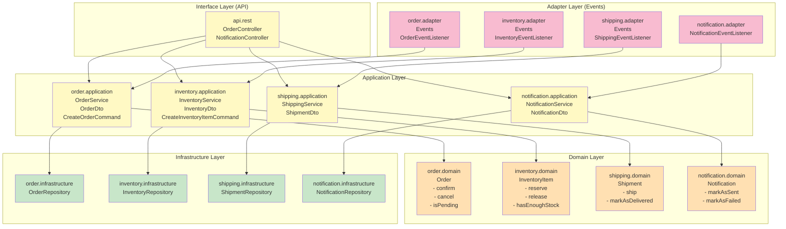
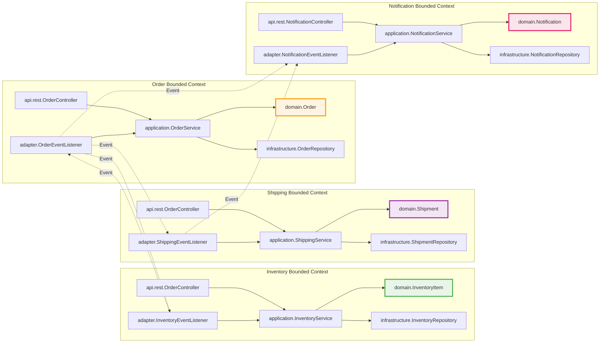
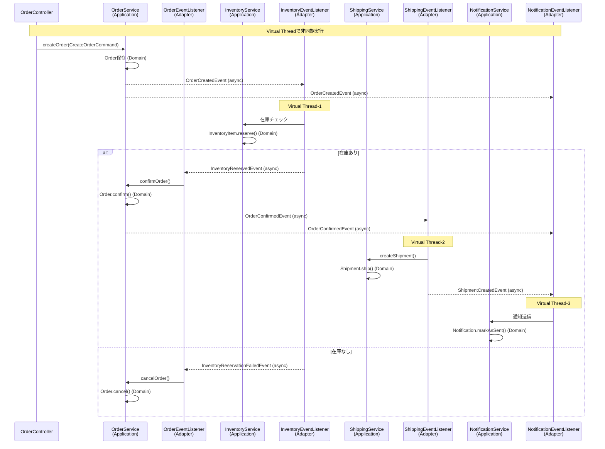
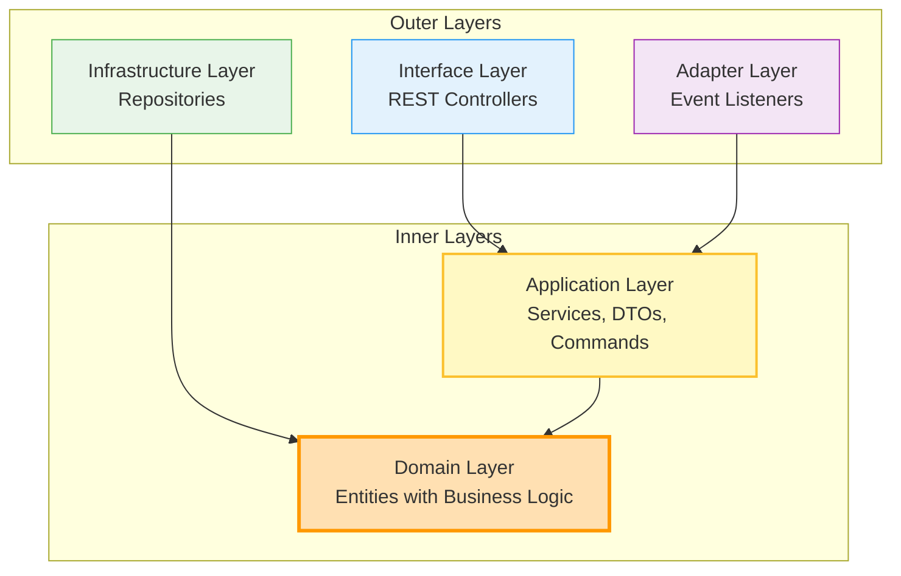

# パッケージ構成図（DDD/クリーンアーキテクチャ版）

## 1. パッケージ構造（ツリー形式）

```mermaid
graph TD
    A[com.example] --> B[api.rest]
    A --> C[config]
    A --> D[order]
    A --> E[inventory]
    A --> F[shipping]
    A --> G[notification]
    A --> H[ModulithVirtualThreadSampleApplication]
    
    B --> B1[OrderController]
    B --> B2[NotificationController]
    
    C --> C1[VirtualThreadConfig]
    
    D --> D1[domain]
    D --> D2[application]
    D --> D3[infrastructure]
    D --> D4[adapter]
    
    D1 --> D1A[Order]
    D2 --> D2A[OrderService]
    D2 --> D2B[OrderDto]
    D2 --> D2C[CreateOrderCommand]
    D3 --> D3A[OrderRepository]
    D4 --> D4A[OrderCreatedEvent]
    D4 --> D4B[OrderConfirmedEvent]
    D4 --> D4C[OrderCancelledEvent]
    D4 --> D4D[OrderEventListener]
    
    E --> E1[domain]
    E --> E2[application]
    E --> E3[infrastructure]
    E --> E4[adapter]
    
    E1 --> E1A[InventoryItem]
    E2 --> E2A[InventoryService]
    E2 --> E2B[InventoryDto]
    E2 --> E2C[CreateInventoryItemCommand]
    E3 --> E3A[InventoryRepository]
    E4 --> E4A[InventoryReservedEvent]
    E4 --> E4B[InventoryReservationFailedEvent]
    E4 --> E4C[InventoryEventListener]
    
    F --> F1[domain]
    F --> F2[application]
    F --> F3[infrastructure]
    F --> F4[adapter]
    
    F1 --> F1A[Shipment]
    F2 --> F2A[ShippingService]
    F2 --> F2B[ShipmentDto]
    F3 --> F3A[ShipmentRepository]
    F4 --> F4A[ShipmentCreatedEvent]
    F4 --> F4B[ShippingEventListener]
    
    G --> G1[domain]
    G --> G2[application]
    G --> G3[infrastructure]
    G --> G4[adapter]
    
    G1 --> G1A[Notification]
    G2 --> G2A[NotificationService]
    G2 --> G2B[NotificationDto]
    G3 --> G3A[NotificationRepository]
    G4 --> G4A[NotificationEventListener]
    
    style A fill:#e1f5ff
    style D fill:#fff4e1
    style E fill:#e8f5e9
    style F fill:#f3e5f5
    style G fill:#fce4ec
    style B fill:#fff9c4
    style C fill:#e0f2f1
    style D1 fill:#ffe0b2
    style D2 fill:#fff9c4
    style D3 fill:#c8e6c9
    style D4 fill:#f8bbd0
```



## 2. クリーンアーキテクチャの層構造



## 3. モジュール境界と依存関係（DDD Bounded Context）



## 4. イベント駆動フロー（Virtual Thread）



## 5. テキスト形式のパッケージ構成（DDD/クリーンアーキテクチャ）

```
com.example
├── api                              # Interface Layer
│   └── rest                         # REST API層
│       ├── OrderController          # 注文関連API
│       └── NotificationController  # 通知関連API
│
├── config                           # 設定クラス
│   └── VirtualThreadConfig          # Virtual Thread設定
│
├── order                            # Order Bounded Context
│   ├── domain                       # Domain Layer
│   │   └── Order                    # エンティティ（ドメインロジック含む）
│   │       - confirm()
│   │       - cancel()
│   │       - isPending()
│   │
│   ├── application                  # Application Layer
│   │   ├── OrderService             # アプリケーションサービス
│   │   ├── OrderDto                 # データ転送オブジェクト
│   │   └── CreateOrderCommand       # コマンドオブジェクト
│   │
│   ├── infrastructure               # Infrastructure Layer
│   │   └── OrderRepository          # リポジトリ（JPA）
│   │
│   └── adapter                      # Adapter Layer
│       ├── OrderCreatedEvent        # イベント
│       ├── OrderConfirmedEvent      # イベント
│       ├── OrderCancelledEvent       # イベント
│       └── OrderEventListener       # イベントリスナー
│
├── inventory                        # Inventory Bounded Context
│   ├── domain
│   │   └── InventoryItem            # エンティティ（ドメインロジック含む）
│   │       - reserve()
│   │       - release()
│   │       - hasEnoughStock()
│   │
│   ├── application
│   │   ├── InventoryService
│   │   ├── InventoryDto
│   │   └── CreateInventoryItemCommand
│   │
│   ├── infrastructure
│   │   └── InventoryRepository
│   │
│   └── adapter
│       ├── InventoryReservedEvent
│       ├── InventoryReservationFailedEvent
│       └── InventoryEventListener
│
├── shipping                         # Shipping Bounded Context
│   ├── domain
│   │   └── Shipment                 # エンティティ（ドメインロジック含む）
│   │       - ship()
│   │       - markAsDelivered()
│   │
│   ├── application
│   │   ├── ShippingService
│   │   └── ShipmentDto
│   │
│   ├── infrastructure
│   │   └── ShipmentRepository
│   │
│   └── adapter
│       ├── ShipmentCreatedEvent
│       └── ShippingEventListener
│
├── notification                     # Notification Bounded Context
│   ├── domain
│   │   └── Notification              # エンティティ（ドメインロジック含む）
│   │       - markAsSent()
│   │       - markAsFailed()
│   │
│   ├── application
│   │   ├── NotificationService
│   │   └── NotificationDto
│   │
│   ├── infrastructure
│   │   └── NotificationRepository
│   │
│   └── adapter
│       └── NotificationEventListener
│
└── ModulithVirtualThreadSampleApplication # メインクラス
```

## 6. 依存関係の方向（クリーンアーキテクチャ）



## 7. アーキテクチャの特徴

### DDD（ドメイン駆動設計）の要素

1. **Bounded Context（境界付けられたコンテキスト）**
   - 各モジュール（order, inventory, shipping, notification）が独立したBounded Context
   - モジュール間はイベントで連携（Context Mapping）

2. **Domain Layer（ドメイン層）**
   - エンティティにビジネスロジックを集約
   - 例：`Order.confirm()`, `InventoryItem.reserve()`, `Shipment.ship()`

3. **Application Layer（アプリケーション層）**
   - ユースケースの実装
   - ドメインオブジェクトの協調
   - DTO/Commandによる入出力の抽象化

### クリーンアーキテクチャの原則

1. **依存関係の方向**
   - 外側の層は内側の層に依存
   - 内側の層は外側の層に依存しない
   - Domain Layerが最も内側（独立）

2. **層の分離**
   - **Domain**: ビジネスロジックの核心（フレームワーク非依存）
   - **Application**: ユースケースの実装
   - **Infrastructure**: 技術的な詳細（JPA、データベース）
   - **Adapter**: 外部システムとの接続（イベント、REST）

3. **関心の分離**
   - 各層が明確な責務を持つ
   - テスト容易性の向上

### Spring Modulithとの統合

- 各Bounded ContextがSpring Modulithのモジュールとして機能
- モジュール間のイベント連携は`@ApplicationModuleListener`で実現
- Virtual Threadによる非同期処理でスループット向上
